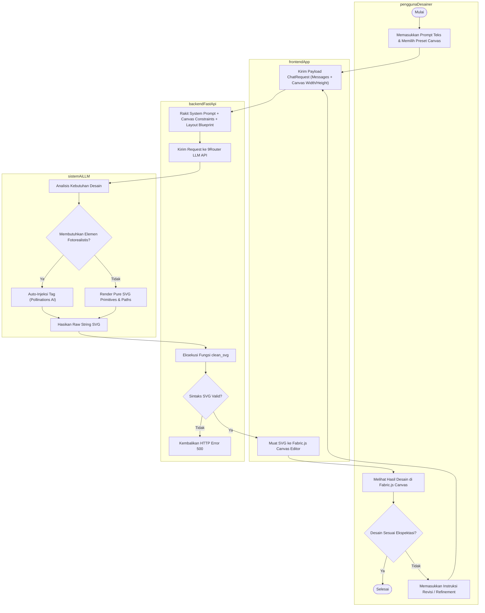
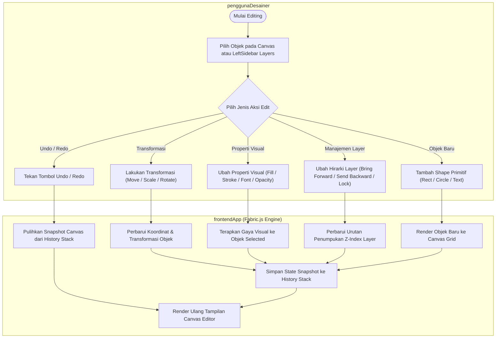
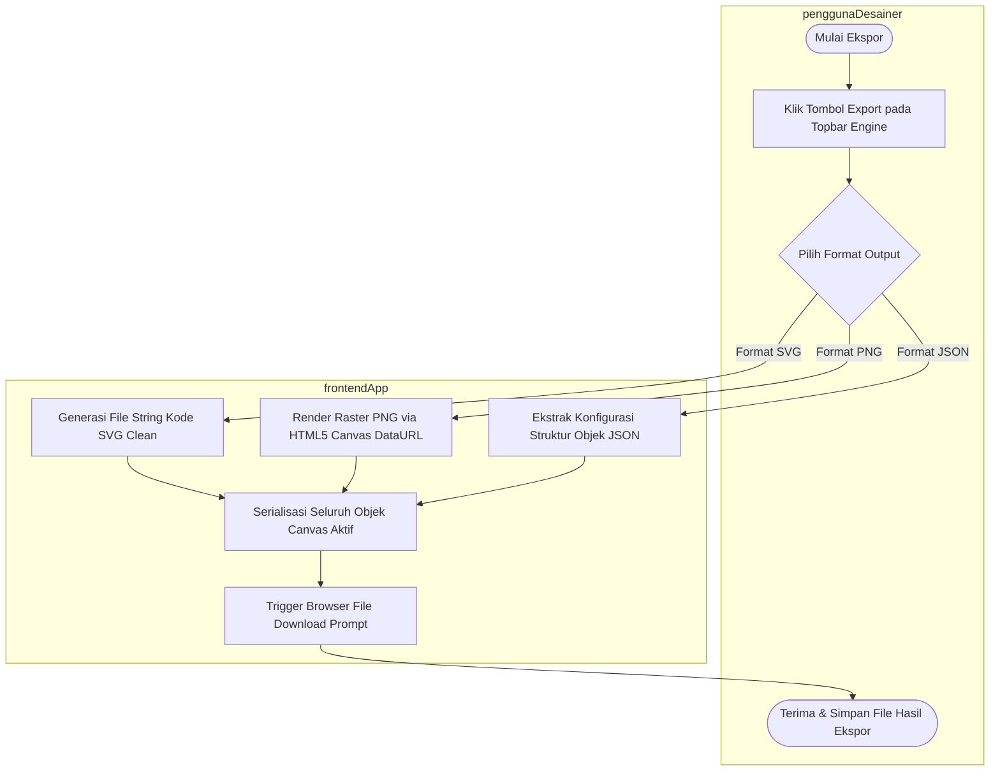

# Activity Diagrams Sistem VEKTRA

Dokumen ini memuat **Activity Diagrams** (Diagram Aktivitas) yang menggambarkan alur kerja (*workflow*) utama pada aplikasi **VEKTRA**.

---

## 1. Activity Diagram: `alurGenerasiDesainVector` (AI Generation & Refinement)

Diagram ini menggambarkan alur kerja pembuatan dan penyempurnaan desain vektor secara otomatis melalui integrasi AI LLM dan *Autonomous Hybrid Rendering*.

---

## 2. Activity Diagram: `alurEditingManualCanvas` (Canvas Manipulation & Property Editing)

Diagram ini menggambarkan alur kerja penyuntingan interaktif pada canvas oleh desainer, termasuk manipulasi objek, penyesuaian properti visual, dan penguraian riwayat aksi (*Undo/Redo*).

---

## 3. Activity Diagram: `alurEksporHasilDesain` (Export & Download Workflow)

Diagram ini menggambarkan alur kerja ekspor file dari editor canvas ke format file lokal pengguna (`SVG`, `PNG`, atau `JSON`).

