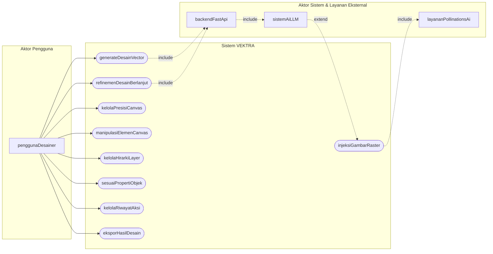

# Diagram Use Case Sistem VEKTRA

Dokumen ini memuat **Diagram Use Case** dan spesifikasi hubungan aktor serta kasus penggunaan (*use cases*) pada aplikasi **VEKTRA**.

---

## 1. Visualisasi Diagram Use Case (Mermaid)

---

## 2. Deskripsi Aktor (Actors)

| Identifier Aktor (camelCase) | Peran & Deskripsi |
| :--- | :--- |
| `penggunaDesainer` | Pengguna atau desainer grafis yang menggunakan antarmuka web aplikasi untuk membuat, merevisi, mengedit elemen grafik secara interaktif, dan mengunduh hasil desain vector SVG. |
| `backendFastApi` | Layanan *backend* FastAPI yang memproses permintaan generasi, menyusun instruksi *system prompt*, mengintegrasikan *layout template*, dan membersihkan output SVG (`clean_svg`). |
| `sistemAiLLM` | Layanan kecerdasan buatan (*9Router LLM Service*) yang menghasilkan kualitatif kode SVG mentah secara otomatis berdasarkan riwayat instruksi pengguna. |
| `layananPollinationsAi` | Layanan penyedia aset gambar *raster* eksternal untuk pendekatan *Autonomous Hybrid Rendering* apabila prompt membutuhkan elemen realitis/fotografik. |

---

## 3. Spesifikasi Use Case

| Use Case (camelCase) | Deskripsi Ringkas | Aktor Utama | Aktor Pendukung / Eksternal |
| :--- | :--- | :--- | :--- |
| `generateDesainVector` | Membuat desain vector SVG baru berdasarkan input prompt deskriptif dari desainer. | `penggunaDesainer` | `backendFastApi`, `sistemAiLLM` |
| `refinemenDesainBerlanjut` | Memperbaiki atau memperbarui desain yang sudah ada secara kontinu melalui riwayat dialog percakapan. | `penggunaDesainer` | `backendFastApi`, `sistemAiLLM` |
| `injeksiGambarRaster` | Menambahkan tag `<image>` dengan URL resolusi tinggi secara otomatis jika prompt memerlukan elemen fotorealistis. | `sistemAiLLM` (*extend*) | `layananPollinationsAi` |
| `kelolaPresisiCanvas` | Mengatur preset resolusi canvas (Square 1080x1080, Banner 1200x628, Poster 800x1200, atau Custom) serta tingkat *zoom* / *pan*. | `penggunaDesainer` | - |
| `manipulasiElemenCanvas` | Menambah bentuk primitif (*rect*, *circle*, *star*, *line*, *text*), memindahkan, menggeser, memutar, dan meresize elemen di Fabric.js canvas. | `penggunaDesainer` | - |
| `kelolaHirarkiLayer` | Mengatur urutan penumpukan z-index (*Bring Forward*, *Send Backward*, dsb.), mengunci (*lock*), atau menghapus objek dari daftar *layer*. | `penggunaDesainer` | - |
| `sesuaiPropertiObjek` | Mengubah atribut estetika elemen seperti warna *fill*, *gradient*, *stroke width*, *opacity*, dan pengaturan tipografi teks. | `penggunaDesainer` | - |
| `kelolaRiwayatAksi` | Melakukan pembatalan (*Undo*) dan pemulihan (*Redo*) terhadap serangkaian perubahan aksi pada canvas. | `penggunaDesainer` | - |
| `eksporHasilDesain` | Menilai dan mengunduh hasil desain vector dalam format file SVG, gambar PNG, atau konfigurasi JSON project. | `penggunaDesainer` | - |

---

## 4. Hubungan Antar Use Case (Relations)

1. **`include` pada `generateDesainVector` & `refinemenDesainBerlanjut`**:
   - Kedua *use case* ini wajib melibatkan `backendFastApi` untuk memproses instruksi dan meneruskannya ke `sistemAiLLM`.
2. **`extend` pada `injeksiGambarRaster`**:
   - *Use case* ini opsional dan diperluas dari `sistemAiLLM` apabila prompt membutuhkan elemen realitis (*Autonomous Hybrid Rendering*).
